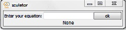
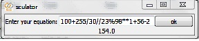
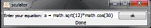

# sculator

Sculator is the smallest but most useful calculator.
No Keyboard: We already have a keyboard and our keyboard has all the symbols which we need. So, I removed the keyboard 
  
And why do our calculators have the limitation of the physical calculators? Why can't we write long equations in our calculators? 
  
And what about variables? Think about a calculator which you can declare variables in it. And also, sculator supports math functions too. 
  
You can also define your own functions in sculator too. For example x = lambda m:m**2-3. Sculator has been written in python. So it supports python's syntax. 
And also, sculator is top most. So, when you are exploring ypur folders or navigating between windows, sculator is still on the top.
